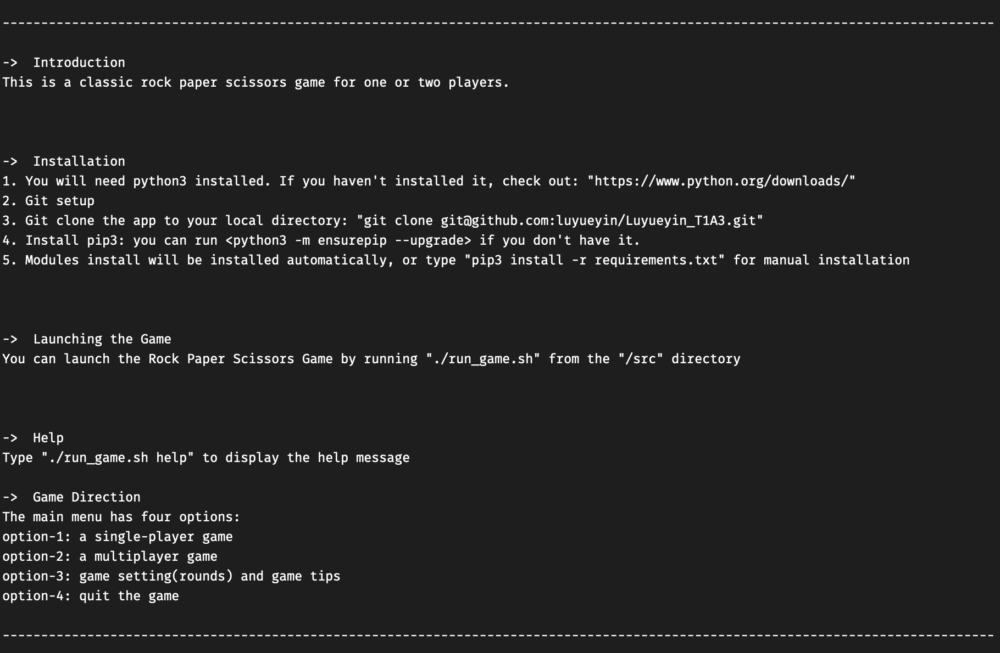
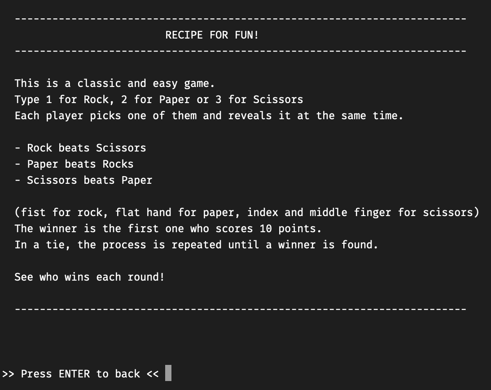

# Rock Paper Scissors Game

This is a classic rock paper scissors game for one or two players.

## Repository Link
[Github Link: https://github.com/luyueyin/Python_Rock-Paper-Scissors](https://github.com/luyueyin/Python_Rock-Paper-Scissors)


## Installation
1. You will need python3 installed. 
      
    If you haven't installed it, check out: https://www.python.org/downloads/
    
2. Once Python3 has been installed, follow the next few steps: 

  - Git clone the app to your local directory: 

      `Python git clone git@github.com:luyueyin/Python_Rock-Paper-Scissors.git`
    
  - Install pip3: 
    
    `Python python -m ensurepip --upgrade` or `Python python3 -m ensurepip --upgrade` 
    
  - Modules will be installed automatically. Manual installation by running: 
  
    `pip install -r requirements.txt` or `pip3 install -r requirements.txt`

  - Display the help message: 
  
    `./run_game.sh help`

3. Launching the app: 
  
    `./run_game.sh` 


## Features
- Feature 1: menu navigation 

- Feature 2: single-player mode 
  - generate random computer choice
  - winner can get 1 point each round
  - compare total scores and repeat the game until a winner is found

- Feature 3: multiplayer mode 
  - hide players’ input

- Feature 4: reset game score 

&nbsp;

## Help Documentation
- Help file: 
```./run_game.sh help```  




- Game Instruction: 

  - launch the game: ```./run_game.sh``` 
  - type 3 for "Options"
  - then type 2 for "Tips"




